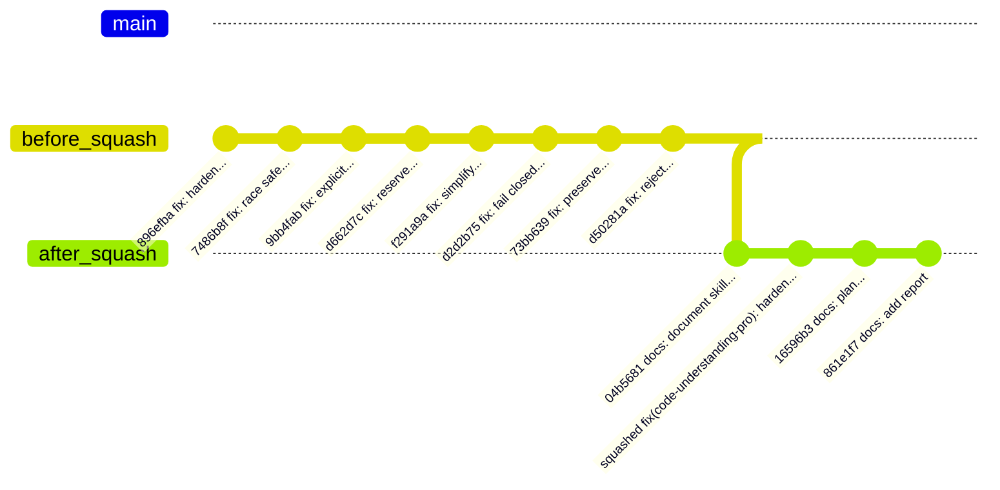

# Artifact_001_squash_fix_commits_0820.md
# FixコミットのSquash計画書およびデザイン仕様
作成日: 2026-08-20 13:45:00 JST | 作成者: Antigravity (Gemini 3.6 Flash)

## 1. 概要
本文書は、リポジトリのコミット履歴に存在する試行錯誤的な連続 `fix:` コミット群を1つの論理的コミットに集約（Squash）するための計画およびデザイン仕様です。

## 2. 現状分析（Requirements）
現在の `master` ブランチのコミット履歴（直近20件）を確認したところ、`code-understanding-pro` スキルのレポート出力および安全性強化に関する一連の修正が以下の 8 個の `fix:` コミットに分割されて記録されています。

```text
d50281a fix: reject partial secret redaction
73bb639 fix: preserve report failure markers
d2d2b75 fix: fail closed on unsafe report output
f291a9a fix: simplify safe report writes
d662d7c fix: reserve explicit outputs by fd
9bb4fab fix: harden explicit report publishing
7486b8f fix: make report publishing race safe
896efba fix: harden code understanding report runs
```

これらはすべて同一機能（`code-understanding-pro` のレポート書き出し処理・セキュリティ対応）に関わる試行錯誤・段階的改善であり、履歴の可読性および保守性を高めるため、1つの意味のあるコミットに squash することが望ましい状態です。

## 3. デザイン（Design & Architecture）

### 3.1 統合対象と squash 後の構造
8 個のコミット (`896efba` 〜 `d50281a`) を統合し、以下のコミットメッセージに集約します。

**統合後のコミットメッセージ案:**
```text
fix(code-understanding-pro): harden report generation and safe output publishing

Consolidates sequential fix iterations for write_report script:
- Harden execution safety and handling of report outputs.
- Ensure race-safe publishing and file descriptor reservation.
- Fail closed on unsafe output and reject partial secret redactions.
- Preserve failure markers accurately across execution steps.
```

### 3.2 コミットツリーの変化 (Mermaid)



### 3.3 リモート影響と安全性対策
- 現在 `master` は `origin/master` と同期済みです。
- rebase / squash 実施後は履歴が書き換わるため、リモートへの更新には `git push --force-with-lease` が必要となります。
- 作業前の安全対策として、現在のコミット状態を保存するバックアップブランチ (`backup/pre-squash-0820`) を作成します。

## 4. タスク計画（Tasks）

1. **バックアップブランチ作成**
   - `git branch backup/pre-squash-0820`
2. **インタラクティブ Rebase による Squash 実行**
   - `git rebase -i 04b5681` (または `GIT_SEQUENCE_EDITOR` を用いた自動制御)
   - `896efba` を `pick` とし、続く7コミットを `squash` (または `fixup`) に指定。
   - 統合コミットメッセージを設定。
3. **リベース結果の検証**
   - `git log` でコミット履歴が意図通りに整理されたことを確認。
   - `pytest` 等で既存機能テストが問題なく通過することを確認。
4. **リモートへの安全な反映**
   - `git push --force-with-lease origin master`
