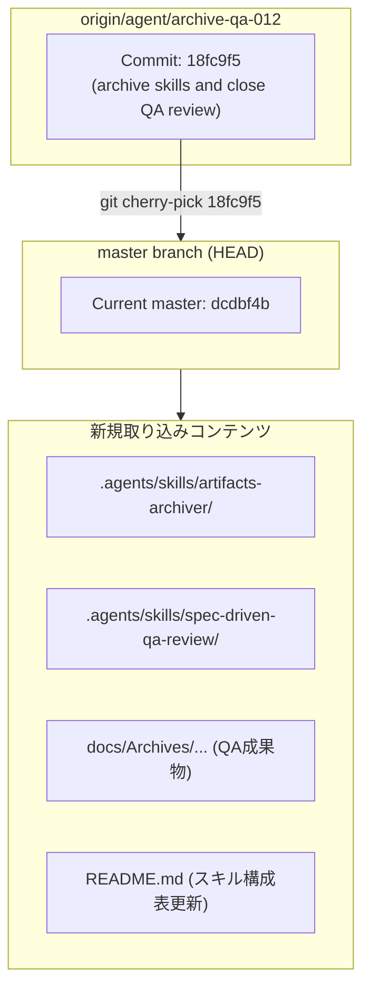

# Artifact_002_cherry_pick_18fc9f5_0820.md

# コミット 18fc9f5 の取り込み計画 (新しいSkillの追加とQAレビュー成果物の統合)

- **作成日**: 2026年8月20日 JST
- **作成者**: Antigravity (Gemini 3.6 Flash)

---

## 1. 概要

リモートブランチ `origin/agent/archive-qa-012` に存在するコミット `18fc9f522100e0567216c3eb8dda718dd4dc5135` (`archive skills and close QA review`) の変更内容を確認し、現在の `master` ブランチへの安全な取り込み（cherry-pick）を計画します。

---

## 2. 変更内容の詳細分析

コミット `18fc9f5` には以下の追加・変更が含まれています。

### 新規追加されるSkill
1. **`artifacts-archiver`** (`.agents/skills/artifacts-archiver/SKILL.md`)
   - 成果物・アーティファクトの整理およびアーカイブ化を自動化するスキル。
2. **`spec-driven-qa-review`** (`.agents/skills/spec-driven-qa-review/`)
   - 仕様駆動QAレビューをマルチサイクル/シングルサイクルで実施・管理する包括的な品質管理スキル群（`SKILL.md`、Pythonスクリプト、JSON Schemas、テンプレート、各種リファレンスドキュメント）。

### 関連するQA成果物・アーカイブドキュメント
- `docs/Archives/QA/QA-0001-plan-012-skill-placement/` (QAケース、トレーサビリティ、レビュー結果等)
- `docs/Archives/archived_summary_001_0819.md`
- `docs/Archives/archived_summary_002_0819.md`
- `docs/Archives/implementation_plan_012_0819.md`

### 設定・リポジトリ情報の更新
- `.gitignore`: pytestキャッシュ等の除外設定追加
- `README.md`: 新規追加Skillの解説およびSkill一覧テーブルの更新

---

## 3. ロジック / データフロー構造 (Mermaid)

---

## 4. 実行手順案 (Tasks)

1. `git cherry-pick 18fc9f5` を実行し、変更内容を取り込む。
2. 追加されたスクリプトおよびスクリプト関連テスト (`pytest`) の動作確認を行う。
3. リポジトリのステータス、コミットメッセージを確認し、必要に応じてプッシュ等の処理を準備する。

---

## 5. 承認確認

上記の取り込み計画についてユーザーの確認と承認を得てから実装（cherry-pick実行）に移行します。
