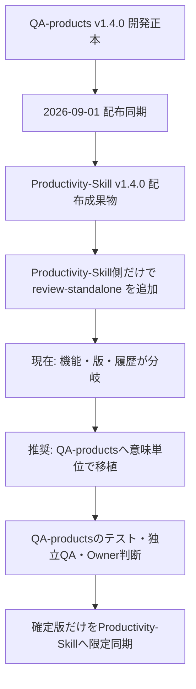

# QAスキル正本・配布先の比較レビュー

## 結論

Productivity-Skill側の`review-standalone`は、単発QA開始の機能としては動作し、QA-products側にはない明確な機能差がある。一方、QA-productsの開発正本、OpenSpec・テスト・版履歴へ統合されていないため、現時点では正式な配布版として扱わない。既存の正式9操作については、今回の差分が追加処理中心であり、既存テストと起動時間の比較から明確な性能劣化は確認できない。

## 対象と前提

- 開発正本：`/Users/myamaguchi/Programing/QA-products/quality-loop/`
- 配布先：`/Users/myamaguchi/Programing/Productivity-Skill/.agents/skills/`
- 比較対象：`quality-review`の開発runtime、同梱runtime、CLI、Skill本文、schema、テスト、同期記録、版情報
- 前提：QA-productsを正本、Productivity-Skillを利用成果物とする既存の配置方針を採用する
- QA-products HEAD：`21dc09d`、作業ツリーclean
- Productivity-Skill HEAD：`b44d47e`、既存の未コミット変更あり

### 実行した確認

- QA-products Quality Loopテスト：115件成功
- QA-products配布ツールテスト：3件成功。実際の同期先ではなく一時ディレクトリを使用
- Productivity-Skillテスト：16件成功
- 両CLIの`--help`確認：QA-productsには`review-standalone`なし、Productivity-Skillにはあり
- 両CLIの`--help`を各20回、3反復実行：QA-products 1.38〜1.40秒、Productivity-Skill 1.40〜1.41秒
- Productivity-Skill側standalone実行：revision 1、`next_role=reviewer`、`next_action=review`、handoffを返し、対象ファイルを変更しないことを確認

起動時間はPythonプロセス起動を含む粗い比較であり、統計的な性能評価や大規模ファイルの負荷試験ではない。

## 全体像

### 変更の目的

Productivity-Skill側では、対象Artifactまたはファイルから最小baselineを準備し、既存の`create-case`へ接続する`review-standalone`が追加されている。QA-products側の正式Quality Loopはv1.4.0のままであり、単発入口を含まない。

### 影響範囲

| コンポーネント | 確認結果 |
|---|---|
| CLI | Product側だけが`review-standalone`を公開 |
| engine | Product側だけが対象manifest、fingerprint、最小baseline、再送照合を実装 |
| 正式9操作 | Product側の差分は追加処理で、既存の`create_case`・`review`本体の変更は見当たらない |
| schema | Product側のSkill参照にだけstandalone schemaがある |
| 版情報 | QA-productsは1.4.0、Productのquality-reviewは1.5.0 |
| quality-response | Product側だけfront matterへ`version: "1.4.0"`を追加 |
| 配布履歴 | 2026-09-01同期後にProduct側だけが先行変更 |

## 処理フロー

## 詳細

### 指摘

| 重要度 | 場所 | 根拠 | 修正案 |
|---|---|---|---|
| **[Major]** | `/Users/myamaguchi/Programing/QA-products/quality-loop/quality_loop/cli.py:21-151`、`/Users/myamaguchi/Programing/Productivity-Skill/.agents/skills/quality-review/runtime/quality_loop/cli.py:21-195` | Product側だけが`review-standalone`をparserと実行分岐へ追加している。QA側CLIでは同じ入力が終了コード2で拒否される。 | QA-productsの開発正本へ移植し、QA-products側テストを先に通過させる。 |
| **[Major]** | `/Users/myamaguchi/Programing/QA-products/quality-loop/quality_loop/engine.py:11-44`、`/Users/myamaguchi/Programing/Productivity-Skill/.agents/skills/quality-review/runtime/quality_loop/engine.py:3-74,1039-1211` | Product側だけがstandaloneの対象hash、最小baseline、case再送照合を持つ。配布元にないため、再同期すると機能が消える。 | `quality_loop/`を正本として実装し、両Skill同梱runtimeとschemaをSHA-256で一致させる。 |
| **[Major]** | `/Users/myamaguchi/Programing/QA-products/AGENTS.md:5-7`、`/Users/myamaguchi/Programing/QA-products/quality-loop/VERSION`、`/Users/myamaguchi/Programing/Productivity-Skill/.agents/skills/quality-review/VERSION` | QA-productsはv1.4.0 CoreのOwner裁定待ち、Product側quality-reviewは1.5.0である。版と受入状態が時系列上つながっていない。 | v1.5.0の実装・独立QA・Owner裁定をQA-products側で記録し、未配布・未受入状態を明示する。 |
| **[Major]** | `/Users/myamaguchi/Programing/Productivity-Skill/.agents/skills/quality-review/runtime/quality_loop/observation.py:26-44` | standaloneは対象ファイルを`read_bytes()`で全量読み込みSHA-256化する。大きな対象では対象サイズに比例してメモリ使用量が増える。 | 通常のMarkdown Artifactを対象とする上限を明示するか、必要性が確認された場合だけチャンク読み込みへ改善する。 |
| **[Consider]** | `/Users/myamaguchi/Programing/Productivity-Skill/tests/test_quality_review_standalone_cli.py:28-258` | standaloneの契約テストはProductivity-Skill側にのみあり、QA-productsの115件には統合されていない。 | 正本側へ正常系、拒否系、再送、対象非変更、正式`review`接続のテストを移植する。 |
| **[FYI]** | `quality-review`のruntime差分全体 | 差分はCLI追加44行、engine追加221行とimport追加が中心で、既存の`create_case`・`review`ロジックを直接書き換えた形跡はない。 | 正式9操作の回帰テストを維持し、追加処理の影響なしを継続確認する。 |

### 性能差の判断

#### 機能性能

Productivity-Skill側は、QA-products側が提供しない「対象指定から正式caseのrevision 1とReviewer handoffを作る」能力を持つ。この点ではProductivity-Skill側が機能的に先行している。ただし、Finding、Evidence判定、Owner裁定は行わないため、正式QAの品質判定能力が高いという意味ではない。

#### 既存操作の実行時間

`--help`の20回反復では、QA-productsが約1.38〜1.40秒、Productivity-Skillが約1.40〜1.41秒だった。差はプロセス起動揺らぎの範囲で、既存9操作の性能劣化を示すEvidenceではない。Product側の追加処理は`review-standalone`分岐のため、既存操作の経路には直接入っていない。

#### 新規操作のコスト

新規操作は、対象ファイル集合をソート・重複排除し、各ファイルを読み込んでSHA-256を計算した後、case JSONをatomic writeする。したがって概算は対象ファイル総量を`S`、ファイル数を`N`として`O(S + N log N)`であり、通常の小さなMarkdown Artifactでは実用上問題になりにくい。大きなファイル、巨大な複数ファイル指定、同時実行時の負荷は未測定である。

## 追加すべきテスト

| ケース | 目的 | 期待結果 |
|---|---|---|
| QA sourceからstandalone正常系 | 正本化 | revision 1、Reviewer handoff、最小baselineを返す |
| QA sourceと両Skill同梱runtimeのhash比較 | 配布整合 | Python sourceの全ファイルが一致する |
| `--target`と`--artifact`の同値性 | API互換 | 同じ対象fingerprintとcase結果になる |
| 欠落・ディレクトリ・読取不能対象 | fail-closed | caseを作成せず安定したエラーを返す |
| 同一case-idで異なる対象を再送 | 誤案件防止 | revisionを変更せず不一致を拒否する |
| bootstrap後の通常`review` | 正式工程接続 | 返却handoffとrevisionで正式reviewが進む |
| 既存9操作の回帰 | 既存契約保持 | 既存115件相当のテストが成功する |
| 1MB、10MB、複数ファイル | 性能境界 | 実行時間、最大メモリ、失敗時の正本無変更を記録する |

## 初学者向け用語解説

| 用語 | 意味 |
|---|---|
| 開発正本 | 機能を実装し、テストと履歴を管理する唯一の基準場所 |
| 配布成果物 | 正本で確認したSkillを利用者向けに取り出したもの |
| bootstrap | 完成判定ではなく、正式工程を開始するための初期準備 |
| handoff | 次のRoleと操作、対象revisionを引き渡す構造化情報 |
| SHA-256 | ファイル内容の変化を検出するためのハッシュ値 |

## 注意点・リスク

- 残存リスク：Productivity-Skill側実装のLLMによるFinding本文品質は、今回のテストでは評価していない。
- 未確認：大容量Artifactのメモリ使用量、並行bootstrap、異なるファイルシステムでの性能、QA-products側の正式独立QAとOwner裁定。
- 時系列リスク：Productivity-Skill側のv1.5.0は、QA-products側のv1.4.0履歴から正式に派生した版として記録されていない。
- 復元：実装開始前にProductivity-Skill側のtracked diffと未追跡ファイルを保存し、正本化失敗時は今回の移植差分だけを戻す。既存変更を含む全体`git restore`は行わない。

## 根拠ファイル・行番号

- `/Users/myamaguchi/Programing/QA-products/AGENTS.md:5`
- `/Users/myamaguchi/Programing/QA-products/AGENTS.md:6`
- `/Users/myamaguchi/Programing/QA-products/AGENTS.md:49`
- `/Users/myamaguchi/Programing/QA-products/quality-loop/FUNCTIONAL_SPEC.md:1`
- `/Users/myamaguchi/Programing/QA-products/quality-loop/FUNCTIONAL_SPEC.md:22`
- `/Users/myamaguchi/Programing/QA-products/quality-loop/quality_loop/cli.py:21`
- `/Users/myamaguchi/Programing/QA-products/quality-loop/quality_loop/engine.py:28`
- `/Users/myamaguchi/Programing/QA-products/quality-loop/quality_loop/observation.py:11`
- `/Users/myamaguchi/Programing/QA-products/quality-loop/SKILL_DEPLOYMENT_GUIDE.md:7`
- `/Users/myamaguchi/Programing/QA-products/docs/Artifacts/quality_loop_sync_001_0901.md:1`
- `/Users/myamaguchi/Programing/Productivity-Skill/.agents/skills/quality-review/runtime/quality_loop/cli.py:21`
- `/Users/myamaguchi/Programing/Productivity-Skill/.agents/skills/quality-review/runtime/quality_loop/engine.py:31`
- `/Users/myamaguchi/Programing/Productivity-Skill/.agents/skills/quality-review/runtime/quality_loop/observation.py:11`
- `/Users/myamaguchi/Programing/Productivity-Skill/tests/test_quality_review_standalone_cli.py:28`
